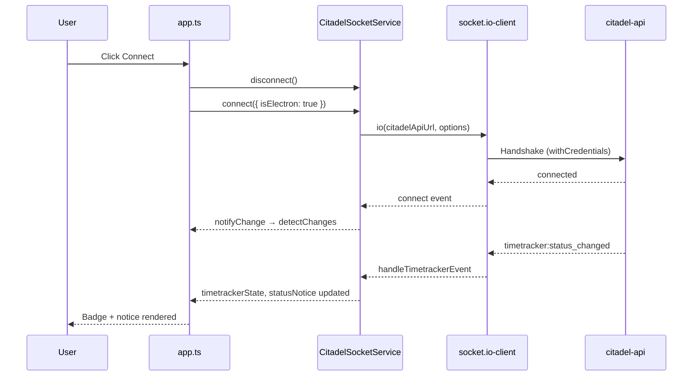
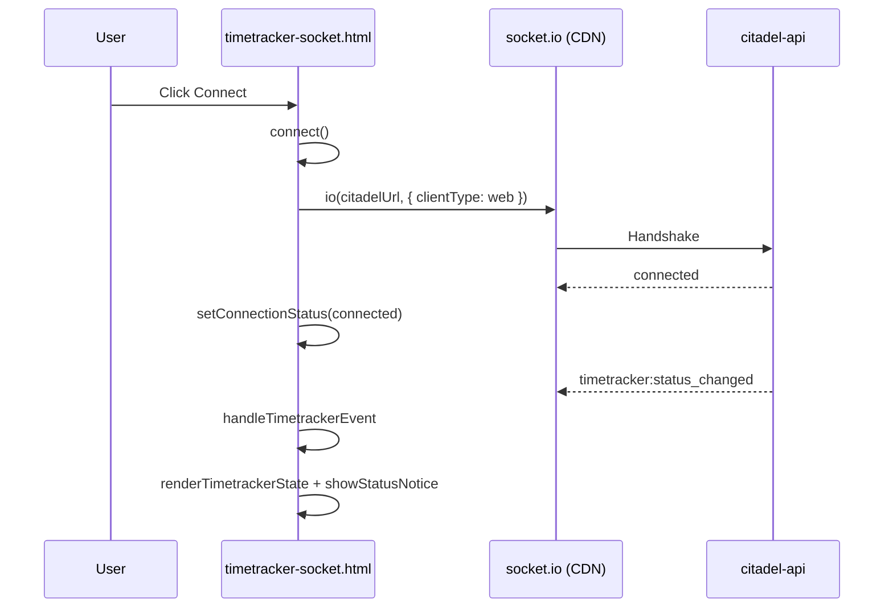

# Socket.IO — Code Implementation Reference

This document is the **code-level companion** to [Socket.IO Integration](./socket-io-integration.md). It describes how each source file implements the connection, event handling, and UI updates in the Electron (Angular) app and the standalone web client.

Authentication is assumed to be handled before connect. This doc does not cover authorization mechanics.

---

## Table of Contents

- [Source file map](#source-file-map)
- [Shared concepts](#shared-concepts)
- [Electron app — file by file](#electron-app--file-by-file)
- [Electron app — call flow](#electron-app--call-flow)
- [Web client — file by file](#web-client--file-by-file)
- [Web client — call flow](#web-client--call-flow)
- [Electron vs web — code parity](#electron-vs-web--code-parity)
- [State and UI binding](#state-and-ui-binding)
- [Extending the implementation](#extending-the-implementation)

---

## Source file map

### Electron (Angular)

| File | Purpose |
|------|---------|
| `src/environments/environment.ts` | `citadelApiUrl` target for `io()` |
| `src/app/constants/timetracker-socket.constants.ts` | Event names, status label map |
| `src/app/models/timetracker-socket.interface.ts` | TypeScript types for payload and notices |
| `src/app/citadel-socket.service.ts` | **Core** — connection, listeners, parsing, notices |
| `src/app/app.ts` | Wires service to template; connect/disconnect lifecycle |
| `src/app/app.html` | Realtime UI (status, badge, notice, debug JSON) |
| `src/app/app.scss` | Styles for socket panel, badges, notices |

`electron/main.js` and `electron/preload.js` do **not** implement Socket.IO. They handle desktop shell concerns only.

### Web (plain HTML)

| File | Purpose |
|------|---------|
| `web/timetracker-socket.html` | Single file: HTML structure, CSS, and all socket logic in `<script>` |

---

## Shared concepts

### Socket.IO client setup

Both implementations call `io(url, options)` with the same contract:

```typescript
io(citadelApiUrl, {
  withCredentials: true,
  auth: { clientType: 'web' | 'electron' },
  transports: ['polling', 'websocket'],
});
```

### Event subscription list

Defined once in Angular (`TIMETRACKER_SOCKET_EVENTS`) and duplicated in the web script:

```
timetracker:state
timetracker:started
timetracker:status_changed
timetracker:stopped
```

Handlers are stored in a `Map<eventName, handler>` so they can be removed cleanly on disconnect.

### Payload validation

Both clients reject invalid payloads before updating UI:

```typescript
// Minimum required fields
typeof payload.staff_id === 'string'
typeof payload.status === 'string'
```

Full shape: `ITimetrackerSocketPayload` in `src/app/models/timetracker-socket.interface.ts`.

### Notice generation

`buildStatusNotice(eventName, payload, previousStatus)` returns a user-facing message or `null`:

| Event | Returns notice when |
|-------|---------------------|
| `timetracker:status_changed` | Always |
| `timetracker:started` | Always |
| `timetracker:stopped` | Always |
| `timetracker:state` | Only if `status` differs from previous state |

---

## Electron app — file by file

### `src/environments/environment.ts`

```typescript
export const environment = {
  citadelApiUrl: 'https://citadel-api-local.vmg-portal.com',
  actoCookieName: 'acto_development',
};
```

- `citadelApiUrl` — passed to `io()` inside `CitadelSocketService`.
- Replace per environment (dev / qa / staging / prod) when packaging.

---

### `src/app/constants/timetracker-socket.constants.ts`

| Export | Type | Usage |
|--------|------|-------|
| `TIMETRACKER_SOCKET_EVENTS` | `readonly string[]` | Loop when registering `socket.on(...)` |
| `TimetrackerSocketEvent` | Union type | Type-safe event names in service |
| `TIMETRACKER_STATUS_LABELS` | `Record<string, string>` | Maps `busy` → `"Busy"` etc. |
| `formatTimetrackerStatus(status)` | Function | Safe label lookup with fallback to raw status |

---

### `src/app/models/timetracker-socket.interface.ts`

**`ITimetrackerSocketPayload`** — mirrors citadel-api event body:

| Field | Type | UI usage |
|-------|------|----------|
| `staff_id` | `string` | Validation only (required) |
| `is_tracking` | `boolean` | Tracking badge on/off |
| `status` | `TimetrackerUserStatus` | Status badge colour and label |
| `timelog_start` | `string \| null` | Shift start display |
| `staff_timelog_id`, `timelog_id`, `status_id` | `string \| null` | Available for future timetracker logic |
| Break fields | `string \| null` / `number` | Available for break UI (not rendered in demo) |

**`ITimetrackerStatusNotice`** — derived UI object for the change banner:

```typescript
{
  event: string;      // e.g. timetracker:status_changed
  message: string;    // e.g. Status changed to Busy
  at: string;         // local time string
  status: TimetrackerUserStatus;
  isTracking: boolean;
}
```

---

### `src/app/citadel-socket.service.ts`

Root injectable (`providedIn: 'root'`). Owns the single `Socket` instance.

#### Public state (read by `App` template via getters)

| Property | Type | Description |
|----------|------|-------------|
| `status` | `SocketConnectionStatus` | `disconnected` \| `connecting` \| `connected` \| `error` |
| `statusMessage` | `string` | Human-readable connection line |
| `lastEventName` | `string \| null` | Last timetracker event received |
| `lastEventPayload` | `string \| null` | Pretty-printed JSON for debug panel |
| `lastEventAt` | `string \| null` | Local time of last event |
| `timetrackerState` | `ITimetrackerSocketPayload \| null` | Latest parsed server state |
| `statusNotice` | `ITimetrackerStatusNotice \| null` | Latest user-facing change message |

#### Public methods

| Method | Description |
|--------|-------------|
| `setChangeListener(fn)` | Registers callback invoked on any state change (used for `ChangeDetectorRef.detectChanges()`) |
| `connect(options)` | Creates or reconnects socket, registers all listeners |
| `disconnect()` | Removes listeners, closes socket, resets connection status |

#### Private methods

| Method | Description |
|--------|-------------|
| `handleTimetrackerEvent(eventName, payload)` | Parse → update state → build notice → notify UI |
| `buildStatusNotice(...)` | Event-specific message logic |
| `parseTimetrackerPayload(payload)` | Runtime validation |
| `setStatus(status, message)` | Updates connection fields + notifies |
| `notifyChange()` | Calls registered change listener |

#### `connect()` sequence

```
1. Guard: already connected → return
2. setStatus('connecting')
3. If socket instance exists → socket.connect() → return
4. socket = io(environment.citadelApiUrl, { ... clientType from isElectron ... })
5. Register connect / disconnect / connect_error
6. For each TIMETRACKER_SOCKET_EVENTS → socket.on(event, handler)
```

#### `disconnect()` sequence

```
1. For each [eventName, handler] in eventHandlers → socket.off(...)
2. eventHandlers.clear()
3. socket.disconnect(); socket = null
4. setStatus('disconnected')
```

---

### `src/app/app.ts`

Thin controller between template and `CitadelSocketService`.

| Lifecycle / method | Code path |
|--------------------|-----------|
| `ngOnInit` | `setChangeListener(() => cdr.detectChanges())` |
| `ngOnDestroy` | `citadelSocket.disconnect()` |
| `reconnectSocket()` | `connectSocket()` |
| `connectSocket()` | `disconnect()` → `connect({ isElectron, ... })` |
| Getters | Delegate to `citadelSocket.*` for template binding |
| `formatStatus()` | Wraps `formatTimetrackerStatus()` |

Template bindings use getters so Angular reads fresh service state after each `notifyChange()`.

---

### `src/app/app.html` (realtime section)

| UI block | Binding | Source |
|----------|---------|--------|
| Connection status | `socketStatus`, `socketStatusMessage` | Service connection fields |
| Connect button | `(click)="reconnectSocket()"` | Triggers full reconnect |
| Live state panel | `*ngIf="timetrackerState as state"` | Latest payload |
| Status badge | `[class]="state.status"`, `formatStatus(state.status)` | CSS modifier per status |
| Tracking badge | `state.is_tracking` | Boolean |
| Change notice | `*ngIf="statusNotice as notice"` | `notice.message`, `notice.event`, `notice.at` |
| Debug JSON | `lastSocketEventName`, `lastEventPayload` | Last raw event |

Styles: `src/app/app.scss` — `.socket-status.*`, `.status-badge.*`, `.status-change-notice`, etc.

---

## Electron app — call flow



---

## Web client — file by file

Everything lives in **`web/timetracker-socket.html`**.

### Structure

| Section | Lines (approx.) | Content |
|---------|-----------------|---------|
| `<style>` | Head | Same visual language as Electron demo |
| HTML | Body | URL input, connect/disconnect, live state, notice, debug `<pre>` |
| CDN script | Before inline script | `socket.io-client` 4.8.1 |
| Inline `<script>` | Bottom | All logic |

### Module-level state (inline script)

```javascript
let socket = null;
let timetrackerState = null;
const eventHandlers = new Map();
const els = { /* DOM element refs */ };
```

### Functions (equivalent to Angular service methods)

| Web function | Angular equivalent |
|--------------|-------------------|
| `connect()` | `CitadelSocketService.connect()` |
| `disconnect()` | `CitadelSocketService.disconnect()` |
| `handleTimetrackerEvent()` | `handleTimetrackerEvent()` |
| `parsePayload()` | `parseTimetrackerPayload()` |
| `buildStatusNotice()` | `buildStatusNotice()` |
| `renderTimetrackerState()` | Template + `timetrackerState` binding |
| `showStatusNotice()` | `*ngIf="statusNotice"` block |
| `setConnectionStatus()` | `setStatus()` |
| `formatStatus()` | `formatTimetrackerStatus()` |

### DOM updates vs Angular

The web client mutates the DOM directly (`textContent`, `className`, `hidden`) instead of using a change-detection cycle. Logic is otherwise identical to the Angular service.

### Running

```bash
npm run serve:web
# → http://localhost:5500/timetracker-socket.html
```

---

## Web client — call flow



---

## Electron vs web — code parity

| Concern | Electron | Web |
|---------|----------|-----|
| Socket creation | `CitadelSocketService` L76 | `connect()` L472 |
| Event loop | `TIMETRACKER_SOCKET_EVENTS.forEach` | Same array, `forEach` |
| Handler cleanup | `Map` + `socket.off` | Same pattern |
| Payload parse | TypeScript interface + guards | Same guards in JS |
| Notice rules | `buildStatusNotice` switch | Identical switch |
| UI update | Angular template + `detectChanges` | Direct DOM |
| Config | `environment.ts` | `#citadel-url` input |

When fixing a bug or adding an event, update **both** implementations unless you later extract shared logic into a published package.

---

## State and UI binding

### Connection state machine

```
disconnected ──connect()──► connecting ──success──► connected
     ▲                            │                      │
     │                            └── error ──► error    │
     └──────── disconnect() / disconnect event ──────────┘
```

### Timetracker state (application)

Updated only when a valid payload arrives on any of the four events. The entire payload replaces `timetrackerState` (no partial merge in current implementation).

### Notice persistence

`statusNotice` is overwritten on each event that produces a notice. It is **not** cleared automatically; the latest notice stays visible until the next one arrives.

---

## Extending the implementation

### Add a new socket event

1. Add the event string to `TIMETRACKER_SOCKET_EVENTS` in `timetracker-socket.constants.ts`.
2. Add the same string to the array in `web/timetracker-socket.html`.
3. Extend `buildStatusNotice()` in both places if the event needs a user message.
4. Register automatically via the existing `forEach` loop — no change to connect/disconnect unless custom one-off listeners are needed.

### Move socket out of root `App` component (Phase 2)

Recommended target structure:

```
src/app/
├── services/
│   └── citadel-socket.service.ts   (unchanged)
├── timetracker/
│   ├── timetracker-state.service.ts  (merge socket state + REST state)
│   └── timetracker.facade.ts         (connect on login, disconnect on logout)
└── shell/
    └── dashboard-shell.component.ts  (calls facade on init)
```

### Add reconnect with backoff

In `CitadelSocketService`, listen to `disconnect` and call `socket.connect()` with exponential delay unless disconnect was intentional (`disconnect()` set a flag).

### Production checklist

- [ ] Remove debug JSON panel from `app.html`
- [ ] Wire connect to auth/session service instead of manual Connect button
- [ ] Add environment file replacements in `angular.json` for each deploy target
- [ ] Confirm `clientType: 'electron'` in packaged Sentinel builds

---

## Related documentation

- [Socket.IO Integration](./socket-io-integration.md) — architecture, connection options, room scoping, implementation plan
