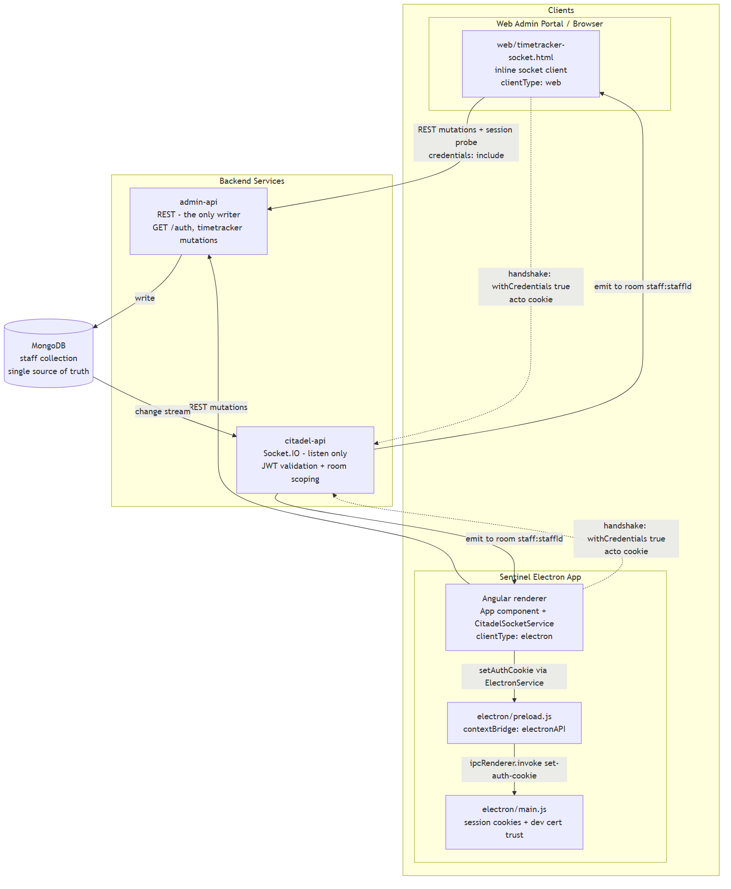
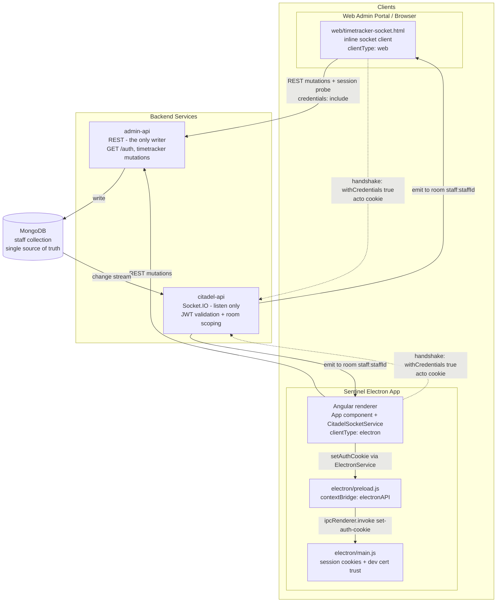
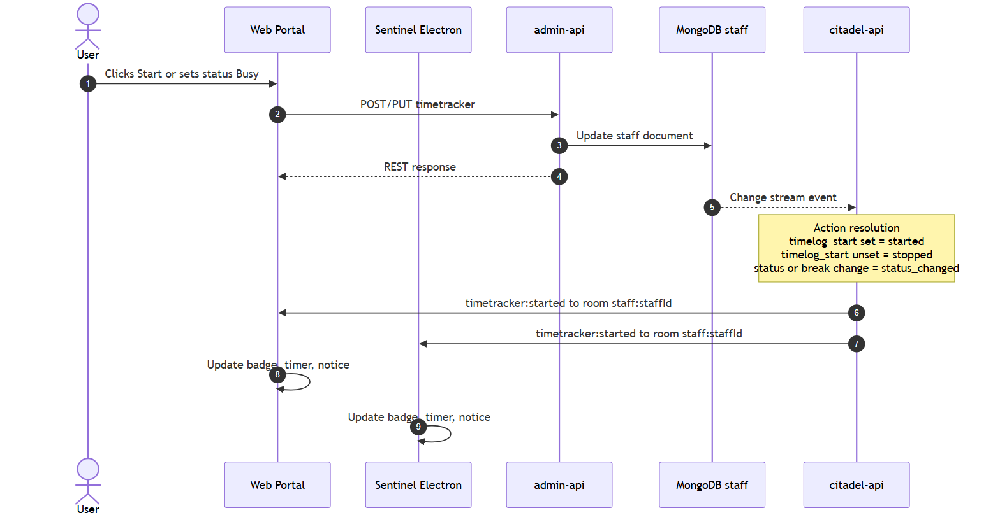
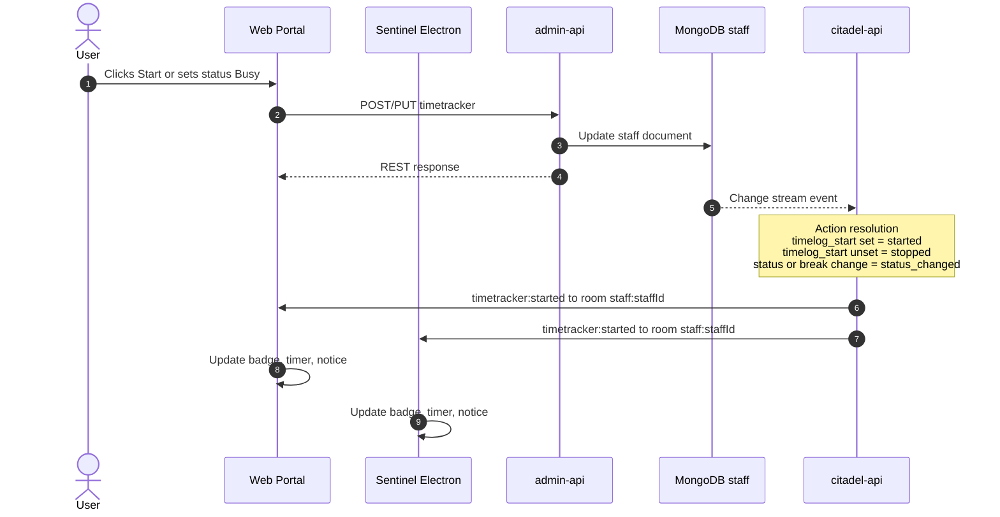
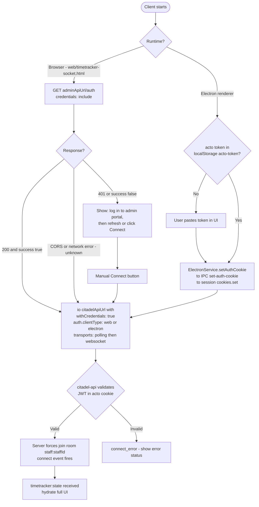
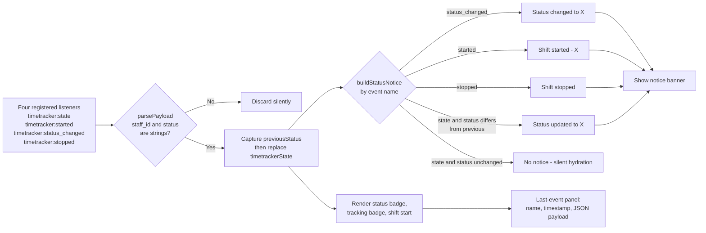
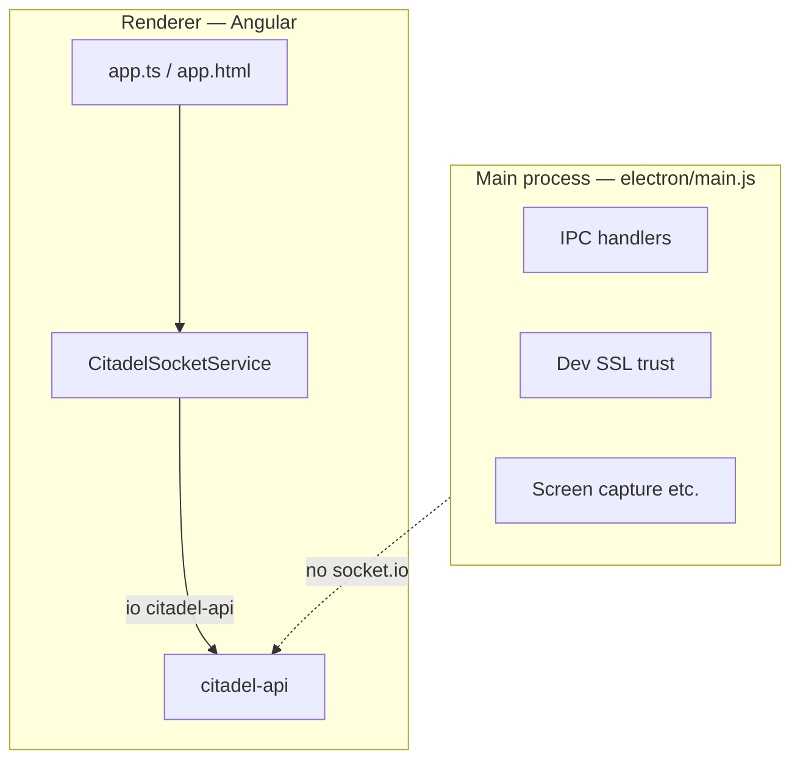
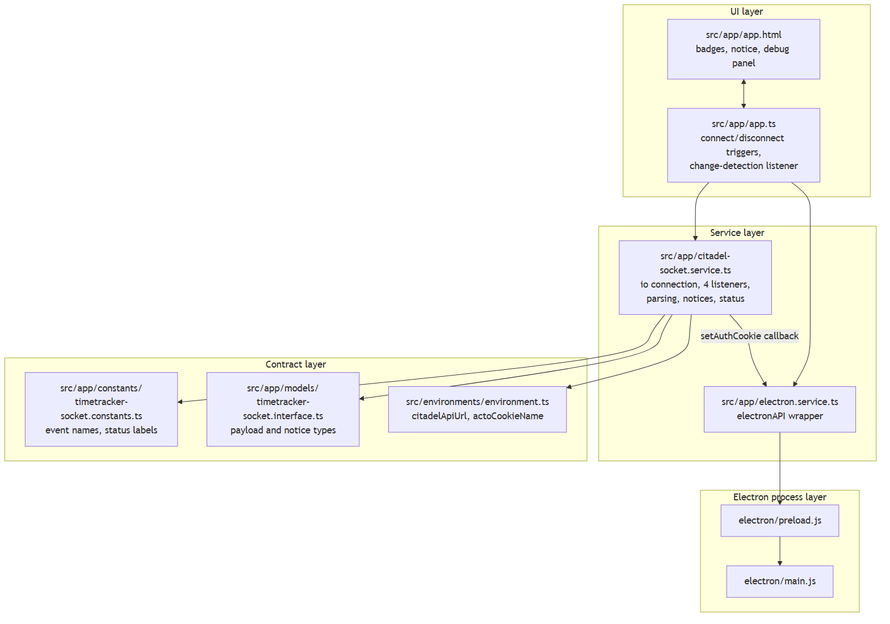
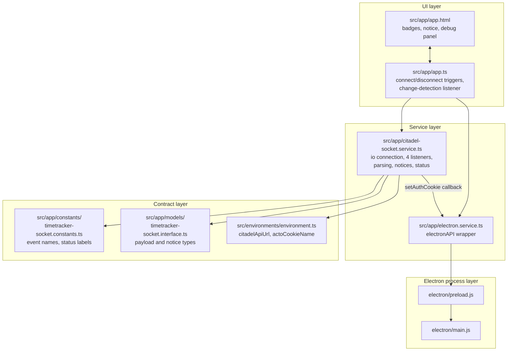

# Socket.IO Integration — Timetracker Realtime

This document describes how VMG Sentinel connects to **citadel-api** over Socket.IO for staff timetracker updates. It covers both the **Electron app** (Angular renderer) and the **standalone web client** (plain HTML).

Authentication is assumed to be handled by the platform (session is already established before connecting). This doc focuses on connection setup, event handling, and UI updates.

---

## Table of Contents

- [Architecture overview](#architecture-overview)
- [End-to-end flow](#end-to-end-flow)
- [Connection establishment](#connection-establishment)
- [Room scoping](#room-scoping)
- [Events and payload](#events-and-payload)
- [Electron app implementation](#electron-app-implementation)
- [Web client implementation](#web-client-implementation)
- [UI behaviour](#ui-behaviour)
- [Implementation plan](#implementation-plan)
- [File reference](#file-reference)
- [Regenerating diagrams](#regenerating-diagrams)
- [Local development](#local-development)
- [Code implementation reference](#code-implementation-reference)

---

## Architecture overview

VMG uses two backends for timetracker:

| Backend | Role |
|---------|------|
| **admin-api** | REST only — start/stop/status changes, writes to MongoDB `staff` collection |
| **citadel-api** | Realtime only (Socket.IO) — listens to MongoDB change streams and pushes updates |

The client never calls citadel-api REST for timetracker mutations. Realtime UI is driven entirely by Socket.IO events after admin-api has updated MongoDB.



Arrows into admin-api are client-initiated REST calls; arrows out of citadel-api are server pushes. No client ever writes to citadel-api.

<details>
<summary>Mermaid source</summary>



</details>

Both clients use **socket.io-client v4** and connect directly from the **renderer** (Angular page or HTML page). The Electron **main process does not** own the Socket.IO connection — it only provides desktop capabilities (screen capture, dev certs, etc.) unrelated to realtime messaging.

---

## End-to-end flow

1. User changes timetracker state via admin-api (web portal, Sentinel, or another client).
2. admin-api updates the `staff` document in MongoDB.
3. citadel-api detects the change via MongoDB change streams.
4. citadel-api emits a Socket.IO event to the staff member’s room.
5. Connected clients receive the event and update the UI.



Because web and Electron share the same room, a single broadcast updates both clients simultaneously.

<details>
<summary>Mermaid source</summary>



</details>

---

## Connection establishment

Both clients use the same Socket.IO client options:

```typescript
import { io } from 'socket.io-client';

const socket = io(CITADEL_API_URL, {
  withCredentials: true,
  auth: {
    clientType: 'web',    // web client
    // clientType: 'electron',  // Electron app
  },
  transports: ['polling', 'websocket'],
});
```

| Option | Purpose |
|--------|---------|
| `withCredentials: true` | Sends session credentials on the handshake (required by citadel-api). |
| `auth.clientType` | Identifies the client as `'web'` or `'electron'` for server-side logging/metrics. |
| `transports` | Starts with HTTP long-polling, then upgrades to WebSocket when available. |

**Lifecycle**

| Phase | Behaviour |
|-------|-----------|
| Connect | User clicks **Connect** (or app auto-connects on startup if configured). |
| Connected | `connect` event fires; UI shows connected status and socket id. |
| Events | Server pushes timetracker events; handlers update state and UI. |
| Error | `connect_error` updates UI with the error message. |
| Disconnect | User closes app, clicks **Disconnect**, or network drops; handlers are removed and socket is destroyed. |

**Important:** The client must **not** call `socket.join(...)` for staff rooms. Room assignment is server-side only (see below).

### Authentication flow per runtime

The two clients reach an authenticated handshake differently. The web page cannot read the HttpOnly `acto` cookie from JavaScript, so it probes `GET /auth` on admin-api with credentials to decide whether a portal session exists before auto-connecting. Electron runs the renderer from `file://`, so it writes the token into the Electron session cookie jar over IPC before calling `io()`.


<details>
<summary>Mermaid source</summary>



</details>

> **Current limitation (Electron):** Sentinel does not yet perform an admin-api login, so `CitadelSocketService.connect()` requires an acto token supplied through the UI and returns `error: 'acto token is required'` when empty. The token is persisted in `localStorage` under `acto-token` and injected into the session cookie jar before connecting. This is a development shim — once Sentinel authenticates against admin-api directly, the cookie will already exist and this manual step disappears (see Phase 2 below).

---

## Room scoping

On connect, citadel-api:

1. Reads the authenticated staff identity from the session.
2. Joins the socket to room `staff:{staffId}` automatically.
3. Emits events with `io.to('staff:{staffId}').emit(...)`.

Effects:

- Only that staff member receives their events.
- The same user on **web + Electron** both receive updates (same room).
- Other staff never receive another staff member’s events.

---

## Events and payload

### Subscribed events

| Event | When it fires | UI notice |
|-------|---------------|-----------|
| `timetracker:state` | Full state sync | Notice only if `status` changed vs previous state |
| `timetracker:started` | Shift started | “Shift started — {status}” |
| `timetracker:status_changed` | Status changed | “Status changed to {status}” |
| `timetracker:stopped` | Shift stopped | “Shift stopped” |

Constants live in `src/app/constants/timetracker-socket.constants.ts` (Electron) and are duplicated in `web/timetracker-socket.html` (web).

### Payload shape

All four events share the same payload structure:

```json
{
  "staff_id": "68c07ed7313447c53652faed",
  "is_tracking": true,
  "status": "busy",
  "timelog_start": "2026-08-11T00:50:09.000Z",
  "staff_timelog_id": "6a7a71c11cce7549d9e8c674",
  "timelog_id": "6a7a71c11cce7549d9e8c675",
  "status_id": "6a7a91cce7549d9e8c69e",
  "lunch_break_start": null,
  "bio_break_start": null,
  "unpaid_break_start": null,
  "lunch_break_consumed": 0,
  "bio_break_consumed": 0,
  "unpaid_break_consumed": 0
}
```

TypeScript interface: `src/app/models/timetracker-socket.interface.ts` (`ITimetrackerSocketPayload`).

Parsing validates at minimum `staff_id` and `status` before updating UI state.

### Event handling pipeline

Both clients register the four event names explicitly by iterating a fixed array — no wildcard listeners. Every event flows through the same parse, state-replace, notice, and render pipeline.


The `timetracker:state` branch is what implements "notice only if the status changed": on a full state sync, a notice appears only when the incoming `status` differs from the cached one, keeping reconnects silent.

<details>
<summary>Mermaid source</summary>



</details>

For file-by-file code walkthroughs, method signatures, and data flow through the source, see **[Socket.IO code implementation](./socket-io-code-implementation.md)**.

---

## Electron app implementation

### Process model



Socket.IO runs in the **Angular renderer**, not in `electron/main.js` or `electron/preload.js`.

### Layer responsibilities

| Layer | Files | Responsibility |
|-------|-------|----------------|
| UI | `src/app/app.html`, `src/app/app.ts` | Connect button, live status badge, change notice, raw payload debug view |
| Service | `src/app/citadel-socket.service.ts` | `io()` connection, event listeners, state parsing, notices |
| Constants | `src/app/constants/timetracker-socket.constants.ts` | Event names, status labels |
| Models | `src/app/models/timetracker-socket.interface.ts` | Payload and notice types |
| Config | `src/environments/environment.ts` | `citadelApiUrl` per environment |



<details>
<summary>Mermaid source</summary>



</details>

### Connection flow (Electron)

1. `App.ngOnInit` registers a change listener on `CitadelSocketService` for Angular change detection.
2. User clicks **Connect** → `App.connectSocket()` → `CitadelSocketService.connect({ isElectron: true, ... })`.
3. Service creates the socket with `clientType: 'electron'`.
4. Service registers handlers for all four `timetracker:*` events.
5. On each event, `handleTimetrackerEvent()` parses payload, updates `timetrackerState`, builds a status notice, and notifies the UI.
6. `App.ngOnDestroy` calls `disconnect()` to remove listeners and close the socket.

### Dependency

- `socket.io-client` ^4.8.x (npm dependency in `package.json`)

---

## Web client implementation

### Overview

A standalone, zero-build HTML page for testing and reference:

- **Path:** `web/timetracker-socket.html`
- **Socket.IO:** Loaded from CDN (`socket.io-client` 4.8.1)
- **Logic:** Inline `<script>` — same events, payload parsing, and UI patterns as the Electron app

### Running locally

```bash
npm run serve:web
```

Open: `http://localhost:5500/timetracker-socket.html`

Configure the citadel-api URL in the page input (default: `https://citadel-api-local.vmg-portal.com`).

### Connection flow (Web)

1. User opens the page (after being logged into the admin portal in the same browser).
2. User clicks **Connect**.
3. Script calls `io(citadelUrl, { withCredentials: true, auth: { clientType: 'web' }, ... })`.
4. Same four event handlers update the DOM: status badge, tracking badge, change notice, and JSON debug panel.

### Electron vs Web

| | Electron (Angular) | Web (HTML) |
|---|-------------------|------------|
| **Runtime** | Electron renderer + Angular | Browser only |
| **`clientType`** | `'electron'` | `'web'` |
| **Connect trigger** | `CitadelSocketService` via `App` component | Inline `connect()` function |
| **State** | Service properties + Angular getters | Module-level variables + DOM updates |
| **Build** | `ng build` + Electron pack | None — open or serve static file |
| **Socket library** | npm `socket.io-client` | CDN script tag |

Core connection options and event handling are intentionally identical.

---

## UI behaviour

Both clients render the same realtime feedback:

1. **Connection status** — `connecting` / `connected` / `disconnected` / `error`
2. **Live timetracker state** — status badge (colour by status), tracking on/off, shift start time
3. **Status change notice** — banner when a meaningful event arrives (e.g. “Status changed to Busy”)
4. **Last event debug** — event name, timestamp, full JSON payload

Status labels are mapped from raw values (`busy` → “Busy”, etc.) via `TIMETRACKER_STATUS_LABELS`.

---

## Implementation plan

This is the intended rollout pattern for timetracker realtime in VMG clients.

### Phase 1 — Connect and listen (current)

- [x] Add `socket.io-client` v4 to Electron app
- [x] Create `CitadelSocketService` with connect/disconnect lifecycle
- [x] Subscribe to all four `timetracker:*` events
- [x] Parse payload and drive a minimal debug UI
- [x] Standalone web HTML client for parity testing
- [x] Dev-only SSL trust for local citadel-api in Electron (`electron/main.js`)

### Phase 2 — Integrate with timetracker UX

- [ ] Move socket lifecycle into a dedicated timetracker/state service (not the root `App` component)
- [ ] Authenticate Electron against admin-api so the acto cookie exists naturally — removes the manual token paste and the `set-auth-cookie` IPC shim
- [ ] Connect after login / dashboard shell load; disconnect on logout
- [ ] Replace debug panel with production UI (header badge, activity bar sync)
- [ ] On socket update, merge into existing timetracker state (avoid redundant REST polling)

### Phase 3 — Resilience

- [ ] Reconnect on transient disconnect
- [ ] Handle session expiry (`connect_error`) with re-auth flow
- [ ] Optional: initial REST fetch on connect, then realtime-only updates

### Phase 4 — Production hardening

- [ ] Environment-specific `citadelApiUrl` for dev / qa / staging / prod
- [ ] Remove dev SSL bypass in packaged builds (`app.isPackaged` guard already in place)
- [ ] Align with full Sentinel app (`vmg-sentinel-client`) patterns for shared services

### Design principles

1. **REST writes, Socket.IO reads** — admin-api mutates; citadel-api pushes.
2. **Renderer-owned socket** — keep Socket.IO in the UI layer unless background sync is required.
3. **No client-side rooms** — server scopes by `staff:{staffId}`.
4. **Same contract for web and Electron** — same URL, events, payload, and `clientType` distinction only.

---

## File reference

### Electron app

```
src/
├── app/
│   ├── citadel-socket.service.ts      # Socket connection and event handling
│   ├── constants/
│   │   └── timetracker-socket.constants.ts
│   ├── models/
│   │   └── timetracker-socket.interface.ts
│   ├── app.ts                         # Wires service to template
│   └── app.html                       # Realtime UI section
└── environments/
    └── environment.ts                 # citadelApiUrl

electron/
├── main.js                            # Desktop shell (not Socket.IO)
└── preload.js                         # IPC bridge (not Socket.IO)
```

### Web client

```
web/
└── timetracker-socket.html            # Self-contained HTML + CSS + JS
```

### Diagrams

```
docs/diagrams/
├── 01-architecture.mmd / .png         # System architecture
├── 02-sync-sequence.mmd / .png        # End-to-end sync sequence
├── 03-auth-flow.mmd / .png            # Connection and auth per runtime
├── 04-event-pipeline.mmd / .png       # Event handling pipeline
└── 05-frontend-modules.mmd / .png     # Frontend module architecture
```

---

## Regenerating diagrams

Each diagram has a `.mmd` source in `docs/diagrams/`. The PNGs are generated with [mermaid-cli](https://github.com/mermaid-js/mermaid-cli); edit the `.mmd` file, then re-render:

```bash
# Single diagram
npx -y @mermaid-js/mermaid-cli@11 -i docs/diagrams/01-architecture.mmd -o docs/diagrams/01-architecture.png -s 2 -b white

# All diagrams
for f in docs/diagrams/*.mmd; do
  npx -y @mermaid-js/mermaid-cli@11 -i "$f" -o "${f%.mmd}.png" -s 2 -b white
done
```

`-s 2` renders at 2x scale so text stays legible in exported PDFs and Confluence; `-b white` avoids transparent backgrounds in dark-mode viewers. The first run downloads a Chromium build for Puppeteer.

Keep the `.mmd` source and the `<details>` block in this document in sync when editing — the collapsible source is what makes diagram changes reviewable in a pull request.

---

## Local development

| Topic | Electron | Web |
|-------|----------|-----|
| **Start** | `npm start` | `npm run serve:web` |
| **citadel-api URL** | `src/environments/environment.ts` | Input field on page |
| **DevTools** | F12 or tray → Toggle Developer Tools | Browser devtools |
| **Local HTTPS** | Electron main process trusts `*-local.vmg-portal.com` certs when unpackaged | Browser must trust the cert, or use a trusted local setup |

To verify realtime: connect both clients, change status from the admin portal, and confirm the event appears in the UI without refreshing.

---

## Code implementation reference

For file-by-file breakdowns, method tables, call-flow diagrams, and extension guides, see:

**[docs/socket-io-code-implementation.md](./socket-io-code-implementation.md)**
