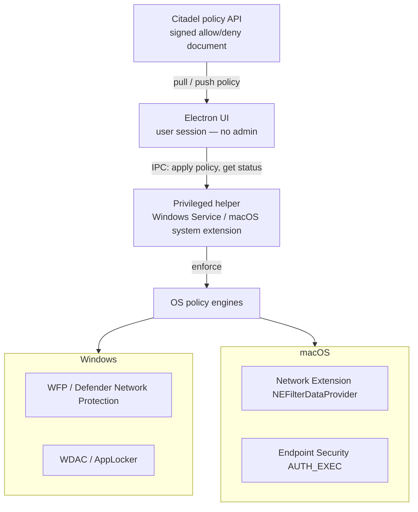

# System-Wide Site and App Blocking

Design and implementation notes for blocking websites and native applications from an Electron desktop agent on **Windows** and **macOS**.

This document captures the architecture, corporate standards, OS-native APIs, failed shortcuts, and a realistic assessment of a privileged-daemon + local-proxy + process-kill approach.

**Shipped Windows behavior** (helper `fw-4`, see [`work-session-blocking-full-documentation.md`](./work-session-blocking-full-documentation.md) and [`work-session-site-and-app-blocking.md`](./work-session-site-and-app-blocking.md)):

- **Sites:** Windows Firewall outbound blocks of DNS-resolved deny-list IPs (not WFP SNI, not hosts file).
- **Apps:** session-gated AppLocker **Allow Everyone `*`** plus **Exe Deny** (path, SHA-256, or publisher) and a **one-shot** close of already-running matches. Deny-only Enabled AppLocker (`fw-3`) is rejected — it default-denies the device. **WDAC XML is never deployed**.
- **Reconcile:** 45s DNS refresh; Firewall/AppLocker rewrite is skipped when the deny lists and resolved IPs are unchanged.
- Rules are lifted on **Stop Tracking**, **Quit** (`SetSession(false)`), helper exit, `--clear-blocks`, and `--uninstall`.
- `npm run dist` runs `verify:helper` and will not package a pre-`fw-4` helper.
- Electron stays unelevated and talks typed IPC only. macOS enforcement is still `TODO(platform)`.

---

## Table of contents

- [Problem](#problem)
- [Scope](#scope)
- [Why Electron cannot do this alone](#why-electron-cannot-do-this-alone)
- [Methods that fail](#methods-that-fail)
- [Target architecture](#target-architecture)
- [Will the daemon + proxy + kill approach work?](#will-the-daemon--proxy--kill-approach-work)
- [Corporate standards](#corporate-standards)
- [Electron-native APIs (in-app only)](#electron-native-apis-in-app-only)
- [OS-native enforcement](#os-native-enforcement)
- [Policy model](#policy-model)
- [Installer, signing, and MDM](#installer-signing-and-mdm)
- [Packages and dependencies](#packages-and-dependencies)
- [Implementation order](#implementation-order)
- [Audit, UX, and compliance](#audit-ux-and-compliance)
- [Test plan](#test-plan)
- [Glossary](#glossary)

---

## Problem

An Electron app runs in user space. It can control **its own** Chromium session. It cannot, by itself:

- stop Chrome, Safari, Edge, or Firefox from opening a site
- stop Steam, Discord, or other native programs from launching
- edit machine-wide firewall, DNS, or application-control policy

System-wide blocking needs **operating-system policy engines** plus a **privileged helper**. The Electron UI is only the control surface.

---

## Scope

Decide this before writing code. The three scopes are not interchangeable.

| Scope | What it blocks | Owner |
|---|---|---|
| **In-app only** | URLs, popups, and permissions inside this Electron app | Electron `session` APIs |
| **System-wide, agent-enforced** | Sites and apps on the whole machine | Privileged native helper using OS APIs |
| **System-wide, IT-enforced** | Same outcome, pushed as device policy | Intune / Jamf / other MDM; agent reports compliance |

Corporate deployments should prefer **MDM as the control plane** and keep the agent as a thin policy client. Rolling a custom transparent proxy and process killer is a consumer parental-control pattern. Endpoint detection tools often treat it as hostile.

Ship **audit mode** before **block mode**. Audit records would-be blocks without interrupting work. That is how Microsoft Network Protection and similar products are introduced.

---

## Why Electron cannot do this alone

Think of the machine as a building. The Electron app sits in one cubicle (user space). It does not hold master keys (Administrator / root). It cannot lock other rooms (other browsers and apps), change building policy (firewall, AppLocker, Network Extension), or install a door that every worker must pass through (system proxy / content filter) without elevation.

| Term | Meaning |
|---|---|
| **Electron** | Desktop shell around Chromium + Node. Renderer is sandboxed; main process is still a normal user process. |
| **System-wide blocking** | Enforcement for every browser and native program, not only this app. |
| **Privileged helper** | Background program with elevation. Windows: Service as `LocalSystem`. macOS: LaunchDaemon via `SMAppService`, or a **system extension**. |
| **IPC** | Local channel between the UI and the helper. Windows: named pipes with ACLs. macOS: XPC (preferred) or a UNIX socket with a code-signing check. |

Electron APIs such as `session.webRequest`, `session.setProxy`, and `webContents.setWindowOpenHandler` apply only to **this app’s Chromium session**. There is no Electron API for Windows Filtering Platform, AppLocker, macOS Network Extension, or Endpoint Security.

---

## Methods that fail

These appear often in tutorials. They are not a product.

### Hosts file (`C:\Windows\System32\drivers\etc\hosts` / `/etc/hosts`)

Map `facebook.com` to `127.0.0.1` so the name “goes nowhere.”

**Why it fails:** Chrome, Edge, and Firefox use DNS-over-HTTPS and skip the hosts file. OS and browser DNS caches plus keep-alive sockets keep existing sessions alive. Requires admin to write the file. Easy to revert.

### Firewall rules on destination IPs

Drop packets to a site’s IP addresses (`pfctl` on macOS, Windows Firewall).

**Why it fails:** Large sites sit on CDNs. IPs rotate constantly. Shared cloud IPs cause collateral damage (you block an unrelated tenant on the same edge node).

### Windows IFEO (Image File Execution Options)

Registry key that attaches `taskkill.exe` (or a debugger) to an executable name so launch “fails.”

**Why it fails:** Antivirus and EDR treat IFEO writes as a malware technique. Users bypass it by renaming the `.exe`. Not an application-control API.

### One-shot `sudo` from Electron

Packages such as `sudo-prompt` pop UAC/admin once to run a command.

**Why it fails:** Elevation is not a daemon. Policy is not persistent, not tamper-resistant, and not a least-privilege design. A compromised renderer should never receive a root shell.

---

## Target architecture

Keep the Electron UI unprivileged. Put enforcement in a minimal privileged helper. The helper accepts **signed policy documents**, not arbitrary shell commands.

```
                    Citadel / policy API
                     signed policy JSON
                    (version, TTL, lists)
                            │
                            ▼
┌───────────────────────────┐         authenticated IPC
│  Electron app (user)      │◄──────────────────────────►┌──────────────────────────────┐
│  - show block reason      │   named pipe / XPC         │  Privileged helper           │
│  - never holds admin      │                            │  Windows: Service (SYSTEM)   │
│  - never runs taskkill    │                            │  macOS: system extension     │
│  - never edits firewall   │                            │    and/or LaunchDaemon       │
└───────────────────────────┘                            │  - apply OS policy           │
                                                         │  - audit log                 │
                                                         └──────────────────────────────┘
                                                                          │
                                                                          ▼
                                                         OS engines: WFP / WDAC /
                                                         NEFilter / Endpoint Security
```

<details>
<summary>Mermaid source</summary>



</details>

### Process split

| Process | Privilege | Responsibility |
|---|---|---|
| Angular renderer + Electron main | Logged-on user | UX, policy fetch, “this was blocked,” never enforces |
| Privileged helper | SYSTEM / root / system extension | Network filter, app-launch deny, DNS/proxy lock, audit |
| Optional user-mode native addon | Logged-on user | Detection only (window titles, process names) |

IPC must authenticate the peer:

- **Windows:** named pipe with ACL limited to the logged-on user and the app SID. Reject unauthenticated local clients.
- **macOS:** XPC with a **code-signing requirement**. A raw UNIX socket is acceptable only with the same check.

The helper’s API is “here is policy version N,” not “run `taskkill /F /IM discord.exe`.” If the UI is compromised, the attacker should not gain a root command channel.

---

## Will the daemon + proxy + kill approach work?

A common proposal is:

1. Electron UI (no admin)
2. Privileged daemon
3. Local Layer-7 proxy + OS proxy settings
4. Firewall-block public DoH resolvers
5. Flush DNS / Chromium socket pools
6. Kill blocked apps with `taskkill` or `NSWorkspace` terminate

**The architecture (1–2) works. The enforcement methods (3–6) only work in a limited, bypassable way.**

### What will work

A SYSTEM/root helper can install a proxy, change system proxy, add firewall rules, flush DNS, and terminate processes. That is enough for a **demo** and for a **casual user** who opens Facebook in Chrome and launches `discord.exe` by name.

### Site blocking via system proxy

| Reality | Outcome |
|---|---|
| HTTPS without a corporate root CA | Proxy sees `CONNECT host:443` / SNI, **not** the path. You can block `youtube.com`, not a specific video. |
| Native apps | Steam, Discord, games, some Electron apps, and tools that use their own stack **ignore OS proxy**. |
| HTTP/3 / QUIC | Browsers use UDP/443 and often skip an HTTP proxy unless QUIC is blocked or disabled. |
| Encrypted Client Hello (ECH) | SNI can be hidden; hostname rules become unreliable. |
| VPN / split tunnel | Traffic leaves beside the proxy. |
| Local admin | User unsets proxy, sets another PAC, or starts a browser with `--no-proxy-server`, unless MDM locks the setting. |
| Blocking public DoH | Helps browsers that would skip local DNS. Does not force apps onto the proxy. Can break corporate DNS. |

**Verdict:** hostname blocking in browsers that honor the system proxy, over TCP HTTPS, for a non-admin user — mostly yes. “All websites, all apps, system-wide” — no.

TLS interception (install a root CA, decrypt HTTPS) can see full URLs. That is a **legal and security decision**, not a default. It breaks certificate pinning, banking and some SaaS apps, and is a compliance event. Hostname/SNI blocking is the realistic product default.

### App blocking via kill-after-launch

Polling the process list and calling `taskkill /F` or `NSWorkspace.terminate` is a restart loop, not a lock.

- The app starts, runs until the next poll, then dies.
- Discord, Steam, and updaters respawn.
- Renaming the binary or using a portable copy bypasses name matching.
- Store / UWP apps and background agents are easy to miss.
- EDR often classifies “enumerate processes and force-kill” as hostile.

**Verdict:** fragile yes for known `.exe` / `.app` names. No as a real control plane.

### Summary table

| Claim | Works? |
|---|---|
| Electron UI + privileged helper + authenticated IPC | **Yes** |
| Block sites inside this Electron app | **Yes** (no helper required) |
| Block listed hostnames in Chrome/Safari for an average user, no VPN | **Mostly yes**, if proxy is locked and QUIC/DoH are constrained |
| Block all web traffic, including apps that ignore the OS proxy | **No** with proxy-only |
| Block Steam/Discord by killing them after start | **Fragile** for matching names; **no** as policy |
| Survive admin users, VPNs, DoH, HTTP/3, renamed binaries | **No** as specified |

### What to use instead of proxy + kill as the primary control

Keep the daemon. Change how it enforces:

1. **Sites:** OS network filter (Windows Filtering Platform or macOS `NEFilterDataProvider`). A local proxy may sit behind that for logging or hostname rules.
2. **Apps:** deny **launch** (WDAC / AppLocker, macOS Endpoint Security `ES_EVENT_TYPE_AUTH_EXEC`). Use terminate only to clean up a process that was already running when policy updated.
3. **Lock configuration with MDM** (proxy, DNS, extension approval). Without that, a local admin undoes the feature.
4. **Do not MITM TLS** unless security and legal have approved a corporate CA.

---

## Corporate standards

These are the rules a security-reviewed corporate agent should meet.

1. **Least privilege.** Electron never runs as admin. A Chromium RCE must not become SYSTEM/root.
2. **Prevent launch; do not kill after launch.** Deny `CreateProcess` / `exec`. Kill is a one-shot reconcile after a policy change.
3. **Block by hostname at a network filter**, not by CDN IP, and not via the hosts file.
4. **No TLS interception by default.** Hostname/SNI only unless a dedicated SSL-inspection program exists.
5. **Server-authored policy.** Signed, versioned allow/deny lists with a TTL. The local user cannot edit enforcement.
6. **Fail closed for enforcement, fail open for safety.** If the helper dies, keep last-known policy for a short TTL. Do not leave a kill loop running with a stale list that can lock the user out of the OS or SSO.
7. **Never use IFEO, WinDivert, unsigned kernel drivers, or hosts-file rewriting.** Those are malware patterns. Defender and CrowdStrike will treat the agent as an attacker.
8. **Code-sign everything.** Windows Authenticode (EV if SmartScreen reputation matters). macOS Developer ID + notarization. Same Team ID on the app and the system extension.
9. **MDM-preapprove extensions** on enterprise fleets. Users should not click through System Settings to enable a corporate agent.
10. **Log every block** (time, user, policy version, rule id, process path, hostname) and show a user-visible reason.
11. **Allowlist business-critical paths:** SSO, this product’s APIs, OS update, and approved collaboration tools.
12. **Tamper resistance without being a rootkit.** Protect service ACLs, require admin to uninstall, report tamper. Do not hide processes or disable security tools.
13. **Audit mode first**, then block mode.

A privileged local HTTP proxy plus “set system proxy” is acceptable only if MDM **locks** the proxy and you block **hostnames**, not decrypted paths. Users can otherwise unset the proxy in Settings.

---

## Electron-native APIs (in-app only)

Use these when the goal is to restrict **this app**, not Chrome or Discord.

| API | Use |
|---|---|
| `session.webRequest.onBeforeRequest` | Cancel or redirect matching URLs |
| `session.setPermissionRequestHandler` | Deny camera, mic, notifications |
| `webContents.setWindowOpenHandler` | Block `window.open` / extra windows |
| `session.setProxy` | Route **this** session through a proxy |
| `ses.clearHostResolverCache()` | Drop DNS cache inside Electron after policy change |
| `ses.closeAllConnections()` | Drop pooled sockets so an old proxy/path is not reused |
| `session.fromPartition` | Isolated sessions with different rules |

In-app example:

```js
session.defaultSession.webRequest.onBeforeRequest(
  { urls: ['*://*.facebook.com/*', '*://facebook.com/*'] },
  (_details, callback) => callback({ cancel: true }),
);
```

`session.setProxy` is not a domain-blocking API. It only changes where **this** Chromium session sends traffic.

There is no npm package that turns these APIs into system-wide enforcement.

---

## OS-native enforcement

Build this in Rust, Swift, or C++ as a **separate privileged binary**, not in the Electron renderer or main process.

### Windows — websites

| Mechanism | Role |
|---|---|
| **Windows Filtering Platform (WFP)** | User-mode filter/callout. Block by hostname (SNI) or tuple at the stack. This is the family of APIs Defender Network Protection uses. |
| **Defender Network Protection + Web Content Filtering** | Prefer integrating with existing MDE / Intune if the tenant already pays for it. |
| **NRPT (Name Resolution Policy Table)** | Force DNS to a corporate resolver. Pair with blocking outbound public DoH. |
| **Intune / MDM indicators** | Custom domain blocks and category filters without shipping a custom proxy. |

A Layer-7 proxy is an optional inspection point, not the only door.

### Windows — applications

| Mechanism | Role |
|---|---|
| **App Control for Business (WDAC)** / **AppLocker** | Deny launch by publisher, path, or hash. Microsoft-supported app block. |
| **WFP bind/connect filters** | App may launch but cannot use the network (useful when the binary must remain installed). |
| `TerminateProcess` | Last resort after a policy update, for a process already running. |

Do not use IFEO. Do not poll `taskkill` as the product.

### macOS — websites

| Mechanism | Role |
|---|---|
| **`NEFilterDataProvider`** | Apple content filter. Ships as a system extension. MDM can preapprove it. |
| **`NEDNSProxyProvider` / `NETransparentProxyProvider`** | DNS or flow proxy without a kernel extension. |
| **MDM web-content filter payload** | IT can attach a filter without a custom proxy. |

`pfctl` and `/etc/hosts` are not supported paths for a notarized enterprise agent. SIP should stay enabled.

### macOS — applications

| Mechanism | Role |
|---|---|
| **Endpoint Security `ES_EVENT_TYPE_AUTH_EXEC`** | Deny `exec` **before** the binary runs. Apple-supported equivalent of WDAC. |
| **MDM allowed / restricted apps** | Fleet-level; no custom killer. |
| `NSWorkspace` terminate | Last resort only. |

Endpoint Security and Network Extension can live in **one system extension** inside the `.app` bundle (the pattern Microsoft Defender for Endpoint on Mac uses). `SMAppService` installs a LaunchDaemon; it does not replace those frameworks.

Apple constraints to budget for:

- `com.apple.developer.endpoint-security.client` is **granted by Apple**, not enabled in Xcode by default.
- User or MDM approval for the system extension and network filtering.
- Notarization of app, extension, and installer.
- Install under `/Applications`.
- Same Team ID on container app and extension.

---

## Policy model

The helper must not invent rules locally. Citadel (or the policy API) authors a document the helper verifies and applies.

Suggested shape:

```json
{
  "version": 42,
  "issued_at": "2026-09-18T00:00:00Z",
  "ttl_seconds": 3600,
  "mode": "audit",
  "signature": "<detached or embedded signature>",
  "sites": {
    "allow": ["login.microsoftonline.com", "citadel.example.com"],
    "deny": ["facebook.com", "youtube.com"]
  },
  "apps": {
    "deny": [
      { "kind": "publisher", "value": "O=Discord Inc." },
      { "kind": "hash", "alg": "sha256", "value": "…" },
      { "kind": "path", "value": "/Applications/Discord.app" }
    ]
  }
}
```

Rules:

- Prefer **publisher and hash** over process file name.
- `mode: audit` writes events and does not deny.
- `mode: block` denies at the OS engine.
- Always allow SSO, OS update, and this product’s own endpoints.
- On helper crash: honor last good policy until `ttl_seconds`, then fail in a documented direction (usually: keep last policy, alert Citadel, do not unlock everything silently in a regulated environment — product/legal must pick this).

IPC messages should be small and typed, for example:

- `ApplyPolicy { document }`
- `GetStatus`
- `GetRecentBlocks { since }`
- `ReportTamper`

Never: `RunCommand { argv }`.

---

## Installer, signing, and MDM

A per-user Electron installer cannot install a Windows service or a macOS system extension.

| Platform | Requirement |
|---|---|
| Windows | Per-machine MSI/NSIS. Service as `LocalSystem`. Authenticode-signed helper and installer. Tight DACL on the service and named pipe. |
| macOS | Signed + notarized `.pkg` or app in `/Applications`. System extension in the bundle. MDM profile to preapprove the extension and, if used, the content filter. |
| Both | Uninstall requires admin. Helper reports uninstall/tamper. |

MDM is part of the design, not an add-on:

- Preapprove the system extension so users are not stuck on System Settings.
- Optionally push WDAC / web-content filter from Intune or Jamf and let the agent only **report compliance**.
- Lock DNS and proxy if you still use a local proxy as a secondary control.

If the fleet already has Microsoft Defender for Endpoint, **do not compete with it**. Prefer indicators / web content filtering / App Control already in that stack, and have the agent display policy and upload extra telemetry.

---

## Packages and dependencies

### Use

| Piece | Role |
|---|---|
| Electron `session.webRequest` | In-app blocks only |
| Native helper in Rust / Swift | Enforcement |
| Windows `windows` crate / Win32 WFP and service APIs | Site and service control |
| macOS Network Extension + Endpoint Security | Site and launch deny |
| `electron-builder` / MSI / pkg | Privileged install |
| Intune / Jamf | Real policy plane on managed devices |

### Do not use as the blocker

| Piece | Why |
|---|---|
| `hostile` and other hosts-file editors | DoH and caches bypass them |
| `sudo-prompt` / `electron-sudo` | One-shot UAC, not enforcement |
| `node-windows` as the product | Service wrapper only |
| IFEO registry keys | EDR malware signature |
| WinDivert / WinPcap | Kernel intercept, AV-flagged |
| `taskkill` polling | Racey, user-hostile, not a policy engine |

There is **no** reputable npm package that implements corporate system-wide blocking. Anything that claims to is wrapping hosts or firewall in a way that fails both review and production.

---

## Implementation order

1. **Define scope** with product and security: in-app vs agent-enforced vs MDM-enforced.
2. **In-app blocking** with `webRequest` if this app loads third-party web content. Cheap and complete for that scope.
3. **Policy schema** in the backend: version, TTL, signature, allow/deny, `audit | block`.
4. **Per-machine installer** and a signed helper with authenticated IPC. No enforcement yet — status and heartbeat only.
5. **Windows:** WFP hostname block + WDAC/AppLocker deny. **macOS:** `NEFilterDataProvider` + `AUTH_EXEC`. Start in **audit mode**.
6. **MDM profiles** to preapprove the extension and lock DNS/proxy if needed.
7. **Block mode** behind a tenant flag.
8. **Terminate already-running processes** as a one-shot reconcile when policy goes from allow to deny — not as a timer loop.

Do not start with a local HTTP proxy and a process-killer. Those are fallbacks and cleanup, not the first milestone.

---

## Audit, UX, and compliance

- Every deny writes a structured event: `policy_version`, `rule_id`, `actor`, `process_path`, `hostname`, `action` (`audit` or `block`).
- The UI shows a short reason (“Blocked by company policy: Social media”) rather than a silent failure.
- Labor and works-council rules in some regions require notice that monitoring/blocking is active. Treat that as a product requirement.
- Allow a break-glass path owned by IT (time-limited exemption), not by the local user.
- Do not log full URLs if the org has not approved TLS inspection; hostname is enough and safer.

---

## Test plan

Cover both the happy path and the bypasses the first design will hit.

**Sites**

- [ ] Listed hostname is blocked in Edge, Chrome, and Firefox on Windows
- [ ] Listed hostname is blocked in Safari, Chrome, and Firefox on macOS
- [ ] HTTPS path is **not** claimed as blocked unless TLS inspection is on
- [ ] Allowlisted SSO still works
- [ ] HTTP/3 / QUIC to a denied host is blocked or forced onto the filter
- [ ] Public DoH does not bypass the filter
- [ ] VPN on/off: document whether the feature is in-scope off-LAN
- [ ] Policy update takes effect without reboot; DNS/socket caches are flushed
- [ ] Audit mode logs and does not interrupt

**Apps**

- [ ] Denied app does not start (launch deny), rather than flashing then dying
- [ ] Publisher/hash rule still applies after the binary is copied or renamed
- [ ] Already-running instance is reconciled once after policy change
- [ ] Allowlisted collaboration apps still start
- [ ] Helper crash does not leave a kill loop; last policy TTL behaves as specified

**Security / ops**

- [ ] Electron process is not admin/root
- [ ] Unauthenticated local process cannot apply policy over IPC
- [ ] Uninstall requires admin and reports tamper
- [ ] EDR in the lab does not flag IFEO, hosts writes, or WinDivert (because those are not used)
- [ ] macOS extension is MDM-preapproved on a managed device
- [ ] Windows service recovers after reboot

---

## Glossary

| Term | Definition |
|---|---|
| **CDN** | Content delivery network. Large sites share rotating IPs; IP blocks are unstable. |
| **DoH** | DNS-over-HTTPS. Browser DNS that ignores the hosts file and sometimes local DNS. |
| **ECH** | Encrypted Client Hello. Can hide SNI from a non-intercepting proxy. |
| **EDR** | Endpoint detection and response (Defender, CrowdStrike, etc.). |
| **IFEO** | Windows Image File Execution Options. Debugger attachment point; abused as an app block. |
| **IPC** | Inter-process communication between UI and helper. |
| **MDM** | Mobile device management (Intune, Jamf, Kandji). |
| **MITM / TLS inspection** | Decrypting HTTPS with a corporate root CA to see full URLs. |
| **NEFilterDataProvider** | Apple Network Extension content filter. |
| **NRPT** | Windows Name Resolution Policy Table. |
| **QUIC / HTTP/3** | UDP-based HTTP. Often bypasses classic HTTP proxies. |
| **SNI** | Server Name Indication. Hostname visible during TLS handshake unless ECH is used. |
| **System extension** | macOS user-space extension (Network Extension, Endpoint Security). Replaces kexts for this class of product. |
| **WDAC / AppLocker** | Windows launch-control policy. |
| **WFP** | Windows Filtering Platform. Stack-level network filtering. |

---

## Decision log

| Date | Decision |
|---|---|
| 2026-09-18 | Electron cannot enforce system-wide blocks; a privileged helper is required. |
| 2026-09-18 | Hosts file, destination-IP firewall, and IFEO are rejected. |
| 2026-09-18 | Split UI / helper architecture is accepted. |
| 2026-09-18 | Local proxy + process kill is **not** the primary enforcement design. |
| 2026-09-18 | Primary enforcement is WFP + WDAC/AppLocker on Windows, NEFilter + Endpoint Security `AUTH_EXEC` on macOS. |
| 2026-09-18 | TLS MITM is opt-in with legal/security approval; default is hostname/SNI. |
| 2026-09-18 | MDM is in-scope for extension approval and for tenants that already have Defender/Intune/Jamf. |
| 2026-09-18 | Policy is server-signed; helper never accepts raw shell commands from Electron. |
| 2026-09-18 | Ship audit mode before block mode. |
| 2026-09-22 | Session-gated AppLocker exe deny + one-shot close running; sites stay INetFw IP blocks. WDAC remains detect-only. |
| 2026-09-22 | Helper `fw-3`: dirty reconcile (skip unchanged apply) and AppLocker hash/publisher XML. DoH remains an IT/GPO concern, not helper registry writes. |
| 2026-09-23 | Helper `fw-4`: AppLocker deny-list requires Allow Everyone `*`; apply refuses without it. Stop Tracking / Quit clear Exe to NotConfigured. Dist verifies staged exe. `unbrick-applocker.ps1` is lab recovery only. |
