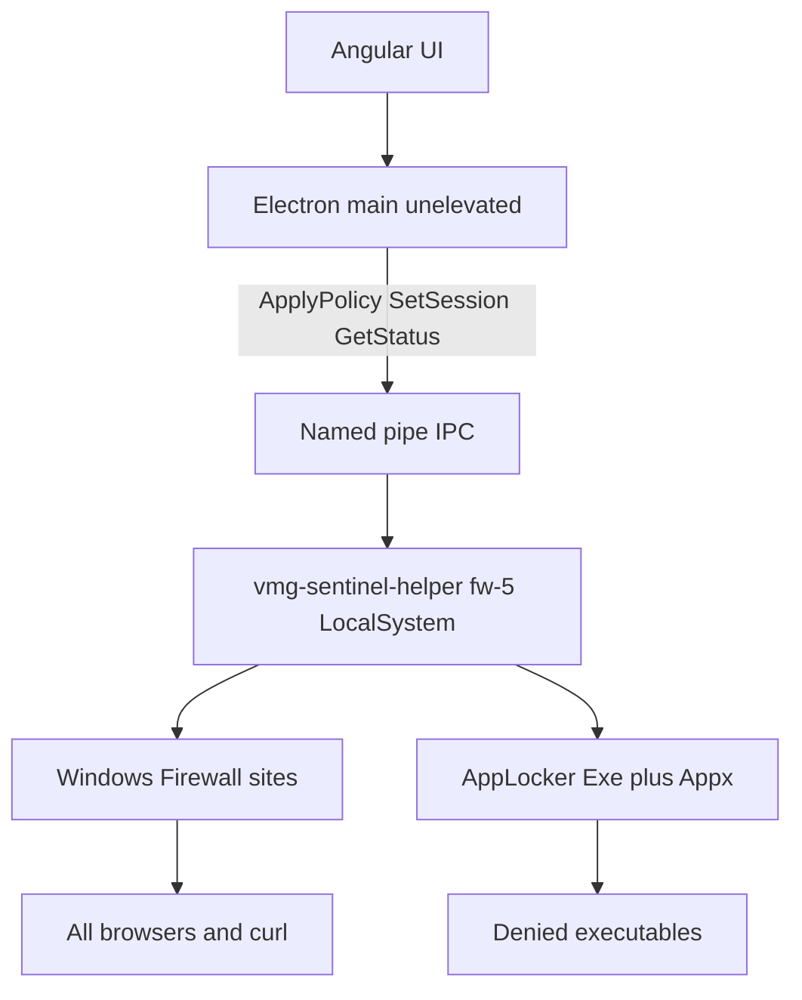

# Work-session site and app blocking — full documentation

Complete reference for **VMG Sentinel** system-wide blocking on Windows: what it does, how it is built, how layers communicate, how to operate it, performance impact, and **pros and cons**.

**Related docs**

| Document | Purpose |
|---|---|
| [work-session-site-and-app-blocking.md](./work-session-site-and-app-blocking.md) | File map, packages, installer commands, tests |
| [work-session-blocking-canvas.pdf](./work-session-blocking-canvas.pdf) | One-page PDF of the architecture canvas (regenerate after fw-5; HTML is current) |
| [system-wide-site-and-app-blocking.md](./system-wide-site-and-app-blocking.md) | Design rationale, rejected approaches, corporate standards |
| [prompts/implement-system-wide-blocking.md](./prompts/implement-system-wide-blocking.md) | Historical implementation prompt (superseded by runbook for day-to-day) |

**Helper build:** `fw-5` (Windows Firewall for sites + AppLocker **Exe** Allow `%WINDIR%\*` / `%PROGRAMFILES%\*` / `*` plus listed denies + **Appx** allow all signed packaged apps so Settings / This PC → Properties stay usable; dirty reconcile; Quit sends `SetSession(false)`). Older helpers including **`fw-4`** are rejected on attach.

---

## Table of contents

1. [Product summary](#1-product-summary)
2. [What gets blocked and when](#2-what-gets-blocked-and-when)
3. [Architecture and layer communication](#3-architecture-and-layer-communication)
4. [Tech stack](#4-tech-stack)
5. [Policy model](#5-policy-model)
6. [Enforcement engines (Windows)](#6-enforcement-engines-windows)
7. [Session lifecycle](#7-session-lifecycle)
8. [IPC and security boundary](#8-ipc-and-security-boundary)
9. [Installation and shipping](#9-installation-and-shipping)
10. [Operations and troubleshooting](#10-operations-and-troubleshooting)
11. [Performance and resource use](#11-performance-and-resource-use)
12. [Production optimization roadmap (review)](#12-production-optimization-roadmap-review)
13. [Pros and cons](#13-pros-and-cons)
14. [Limitations and known issues](#14-limitations-and-known-issues)
15. [Explicitly out of scope](#15-explicitly-out-of-scope)
16. [Future work](#16-future-work)
17. [Glossary](#17-glossary)

---

## 1. Product summary

VMG Sentinel is an Electron desktop agent with an Angular UI. **System-wide blocking** means listed **websites** and **native applications** are restricted for the **whole machine** (Chrome, Edge, curl, Steam, Spotify, etc.), not only inside Sentinel’s own browser window.

**Core product rule:** enforcement applies **only while the user is on the clock**:

- Sentinel **Start Tracking**, or
- Citadel time tracking with a **working** status (`online`, `busy`, `in_a_meeting`, `official_business`).

When tracking **stops** or the user **quits** Sentinel, firewall and AppLocker rules created by Sentinel are **removed**. The PC returns to normal. End users never run recovery scripts.

**Security split:** the Electron app runs **unelevated** (normal user). It never writes firewall rules, never merges AppLocker policy, and never runs arbitrary elevated commands. A separate **`vmg-sentinel-helper.exe`** Windows service runs as **LocalSystem** and applies OS policy after verifying **signed** policy JSON from Electron.

---

## 2. What gets blocked and when

### 2.1 Enforcement matrix (shipped `fw-5`)

| Target | Mechanism while tracking | When tracking stops or the app quits |
|---|---|---|
| **Sites** (deny list hostnames) | Windows Defender Firewall **outbound BLOCK** on DNS-resolved **IPv4/IPv6** addresses | All rules in display group **`VMG Sentinel`** removed |
| **Apps** (deny list executables) | AppLocker **Exe** Allow `%WINDIR%\*` + `%PROGRAMFILES%\*` + Everyone `*` (`VMG Sentinel allow all`) plus **Exe Deny** (path / SHA-256 / publisher); **Appx** Enabled with **Allow all signed packaged apps** (`VMG Sentinel allow all packaged`) so Settings / This PC → Properties are not blocked | `VMG Sentinel *` rules removed; Exe **and Appx** **NotConfigured** |
| **Already-running deny apps** | **One-shot** terminate when session starts (not a periodic kill loop) | User can launch again after stop |

Sites are **network-blocked** (any process). Listed Win32 apps are **launch-blocked** on SKUs that enforce AppLocker (cannot open during the session, including offline use). Windows Settings and other signed packaged apps stay **allowed**.

### 2.2 What turns enforcement on or off

| Event | Effect |
|---|---|
| **Start Tracking** (Sentinel) | `SetSession { active: true }` → helper reconciles → rules applied if policy `mode: block` |
| **Stop Tracking** | `SetSession { active: false }` → rules cleared |
| **Quit** Sentinel | `SetSession { active: false, reason: app-quit }` → same clear |
| Citadel `is_tracking` + working status | Same as Start Tracking (via main process) |
| Citadel offline / break / not working | Same as Stop Tracking |
| Helper exit / service stop | `clear_enforcement()` on shutdown |
| `--clear-blocks` or `--uninstall` | Wipe leftover firewall + AppLocker rules, then optionally remove service |

Policy can be **loaded** while idle; blocks apply only when **session active** + **block mode** + **policy not expired**.

### 2.3 Default local deny list (until Citadel policy loads)

Used when `VMG_SENTINEL_DEV_POLICY` is not `0` (default for `npm start` and packaged builds):

**Sites:** `facebook.com`, `youtube.com`, `instagram.com`, `tiktok.com`, `reddit.com`, Reddit CDNs (`redditstatic.com`, `redditmedia.com`, `redd.it`), `twitter.com`, `x.com`.

**Apps:** `steam.exe`, `spotify.exe` (path rules → AppLocker `*\steam.exe`, `*\spotify.exe`).

Citadel `GET …/v1/agent/endpoint-policy` replaces this when a signed document is returned successfully.

**Seed allowlist:** SSO, Citadel, Microsoft 365, and OS-update hosts are always merged into `sites.allow` (Rust + JS lists must stay aligned).

---

## 3. Architecture and layer communication

### 3.1 Control path (ASCII)

```
┌─────────────────────────────────────────────────────────────────┐
│  Angular UI (renderer)                                          │
│  Start / Stop Tracking, policy banner — NO access to helper     │
└───────────────────────────────┬─────────────────────────────────┘
                                │ preload / IPC to main only
                                ▼
┌─────────────────────────────────────────────────────────────────┐
│  Electron main (logged-on user, unelevated)                     │
│  • work-session gate (local + Citadel)                          │
│  • fetch / verify Ed25519 policy                                │
│  • named-pipe client only                                       │
└───────────────────────────────┬─────────────────────────────────┘
                                │
              \\.\pipe\vmg-sentinel-helper
              length-prefixed JSON, method allowlist
                                │
                                ▼
┌─────────────────────────────────────────────────────────────────┐
│  vmg-sentinel-helper.exe  (VMGSentinelHelper, LocalSystem)      │
│  build fw-5 • verify policy • 45s reconcile (skip if unchanged) │
└───────────────┬─────────────────────────────┬───────────────────┘
                │                             │
                ▼                             ▼
   ┌────────────────────────┐    ┌──────────────────────────────┐
   │ Windows Firewall       │    │ AppLocker Exe + Appx         │
   │ INetFwPolicy2 outbound │    │ Set-AppLockerPolicy -Merge   │
   │ RemoteAddresses / App  │    │ + Application Identity svc   │
   └───────────┬────────────┘    └──────────────┬───────────────┘
               │                                  │
               ▼                                  ▼
        Chrome, Edge, curl                   steam.exe, spotify.exe
        (any outbound to deny IPs)           (CreateProcess denied;
                                              Settings / This PC OK)
```

### 3.2 Mermaid (for Confluence / GitHub)



### 3.3 Responsibility by layer

| Layer | Privilege | Owns |
|---|---|---|
| Angular renderer | User | UX, banner, tracking buttons |
| Electron main | User | Policy fetch/sign verify, session logic, pipe client |
| Helper service | LocalSystem | DNS, INetFw rules, AppLocker XML, one-shot process close, audit events |
| Windows OS | Kernel / policy engine | Packet drop, launch deny |

The renderer **never** opens the named pipe. A compromised Chromium renderer cannot call `ApplyPolicy` without going through main (and main still cannot execute shell on the helper).

---

## 4. Tech stack

| Layer | Technology |
|---|---|
| UI | Angular 21, TypeScript |
| Desktop shell | Electron 42 (main + preload) |
| Policy verification | Node `crypto` (Ed25519), Rust `ed25519-dalek` |
| Helper | Rust, `tokio`, `windows` 0.58, `windows-service` 0.7 |
| IPC | Windows named pipe, length-prefixed JSON, SDDL at `CreateNamedPipe` |
| Site enforcement | `INetFwPolicy2` / `INetFwRule`, group `VMG Sentinel` |
| App enforcement | AppLocker via PowerShell `Set-AppLockerPolicy -Merge` / `Get-AppLockerPolicy` |
| App ID service | `sc.exe config/start AppIDSvc` when applying launch deny |
| Legacy cleanup | WFP filter removal if old helpers left state |
| WDAC / MDE | **Detect only** — never deploy WDAC XML from this helper |
| Packaging | `electron-builder` NSIS **per-machine**, `build/installer.nsh` hooks |
| Tests | `cargo test` (helper), `npm run test:policy` (Vitest) |

**Build identifier:** Electron expects `helper_build === "fw-5"` in `GetStatus`. Older helpers (`wfp-1`, `fw-1`, `fw-2`, `fw-3`, **`fw-4`**) are rejected on attach. `npm run dist` runs `verify:helper` and will not package an exe that is not `fw-5` or that lacks `VMG Sentinel allow all`, `VMG Sentinel allow Windows`, or `VMG Sentinel allow all packaged`.

---

## 5. Policy model

Signed JSON document (Citadel or local dev signer):

```json
{
  "version": 1,
  "issued_at": "2026-09-22T00:00:00Z",
  "ttl_seconds": 604800,
  "mode": "block",
  "signature": "<hex Ed25519>",
  "sites": {
    "allow": [],
    "deny": ["reddit.com", "youtube.com"]
  },
  "apps": {
    "deny": [
      { "kind": "path", "value": "steam.exe" },
      { "kind": "hash", "alg": "sha256", "value": "…" }
    ]
  }
}
```

| Field | Behavior |
|---|---|
| `mode: block` | Deny at OS when session active |
| `mode: audit` | Log would-block events; no firewall/AppLocker deny (unless audit engine selected) |
| `ttl_seconds` | After expiry, effective mode becomes **audit** (document kept) |
| `apps.deny` | Path, SHA-256 hash, and publisher rules → AppLocker XML. Microsoft Windows publishers are rejected. |
| `signature` | Required; helper stores verified copy as `last-good.json` |

Environment overrides on the helper:

| Variable | Effect |
|---|---|
| `VMG_SENTINEL_AUDIT_ONLY=1` | Skip filters; audit only |
| `VMG_SENTINEL_TERMINATE=1` | Opt-in terminate engine (not default product path) |

Electron:

| Variable | Effect |
|---|---|
| `VMG_SENTINEL_DEV_POLICY=0` | Disable local signed deny list |
| `VMG_SENTINEL_SPAWN_HELPER=1` | Allow spawn (non-Windows dev); Windows default is attach-only |

---

## 6. Enforcement engines (Windows)

### 6.1 Sites — Windows Firewall (not hosts file, not WFP SNI)

1. For each deny hostname, helper resolves `hostname` plus prefixes `www.`, `m.`, `old.`, `i.`, `v.`, `preview.`
2. Creates **outbound BLOCK** rules with `RemoteAddresses` set to resolved IPs (v4 and v6 split as needed).
3. Rules are **persistent** until cleared — hence mandatory cleanup on stop/uninstall.

**Implication:** blocking is **IP-based**. CDN rotation, DNS-over-HTTPS, and unlisted hostnames can still reach a site.

### 6.2 Apps — AppLocker launch deny + firewall app rules + one-shot close

When session block is active:

1. **AppLocker Exe:** merge XML that always includes Microsoft-style allows — **`%WINDIR%\*`** (`VMG Sentinel allow Windows`), **`%PROGRAMFILES%\*`** (`VMG Sentinel allow Program Files`), and **Everyone `*`** (`VMG Sentinel allow all`) — plus listed denies. There is **no** “Allow Administrators `*`” rule (BYOD users are often admins; that would let them launch Steam). Apply **refuses** if the Exe allow-all, Windows/Program Files allows, or packaged allow are missing (deny-only Enabled AppLocker locks Task Manager; Exe-only without Appx locks Settings / This PC → Properties). Path / hash / publisher denies as before.
2. **AppLocker Appx:** **Enabled** with **Allow all signed packaged apps** (`VMG Sentinel allow all packaged`). Required so Windows 11 Settings / This PC → Properties stay usable. We do not deny any packaged app. Leaving Appx `NotConfigured` is not reliable once AppIDSvc + Exe enforcement are on.
3. **Firewall application rules:** for **currently running** processes matching deny rules, add outbound block by **that exact application path**. Child processes (for example `steamwebhelper.exe`) are not listed and can still use the network. The rule appears after the helper sees the process (up to the 45s reconcile).
4. **One-shot close:** enumerate processes once per policy version; terminate matches (Steam/Spotify if already open when tracking starts). **Not** a 45s kill loop.

**Safe deny targets:** helper rejects Windows paths, Sentinel binaries, and shell/system process names (`explorer.exe`, `lsass.exe`, `systemsettings.exe`, `systemsettingsadminflows.exe`, `systemproperties*.exe`, `control.exe`, `taskmgr.exe`, etc.). Invalid hashes are ignored. Publisher values that match Microsoft Windows / Microsoft Corporation are rejected so a bad policy cannot deny the OS.

### 6.3 Reconciliation loop

While `session_active`:

- Every **45 seconds**, helper re-resolves DNS and compares a fingerprint of deny lists, resolved IPs, and running deny-app paths.
- If nothing changed (and the last apply had no error), **firewall and AppLocker are not rewritten**.
- If only IPs or running deny-app paths changed, firewall rules refresh and **AppLocker PowerShell is skipped**.
- Full AppLocker merge runs when the deny lists or session gate change, or when the previous apply failed (`last_error`).

On `ApplyPolicy` or `SetSession`, reconcile runs immediately (still subject to the same fingerprint skip if the lists are identical).

---

## 7. Session lifecycle

```
Install (NSIS) or --install
    → VMGSentinelHelper service starts (LocalSystem)
    → pipe listening, policy store under %ProgramData%\VMG\Sentinel\policy-helper

User opens Sentinel (npm start or installed app)
    → Electron attachPolicyHelper (no spawn on Windows packaged/unpackaged default)
    → GetStatus; refuse if helper_build ≠ fw-5

If policy_loaded false
    → ApplyPolicy(local signed deny list from dev-block-policy.js)

User Start Tracking
    → pushWorkSession → SetSession(true) → reconcile → FW + AppLocker

User Stop Tracking (or Citadel idle)
    → SetSession(false) → clear FW + AppLocker (Exe and Appx NotConfigured)

User uninstalls
    → --clear-blocks then --uninstall (installer.nsh)
    → remove VMG Sentinel firewall rules + AppLocker Exe/Appx rules + delete service
```

**Citadel-only installs:** blocking still works if local dev policy is enabled; otherwise user needs a signed Citadel policy with `mode: block`.

---

## 8. IPC and security boundary

**Pipe:** `\\.\pipe\vmg-sentinel-helper`

**Allowed methods only:**

| Method | Caller | Purpose |
|---|---|---|
| `ApplyPolicy` | Electron main | Store verified policy document |
| `SetSession` | Electron main | Turn enforcement on/off for work session |
| `GetStatus` | Main / UI | `engine`, `app_engine`, `helper_build`, `privilege`, `enforcing`, `last_error` |
| `GetRecentBlocks` | Optional | Recent audit / block events |
| `ReportTamper` | Reserved | Tamper log append |

**Forbidden:** `RunCommand` or any arbitrary argv channel — prevents UI compromise → SYSTEM shell.

**Authentication:** peer must be an authenticated user context; pipe created with restrictive SDDL. A second user-level helper often gets **Access denied** if the service owns the first pipe instance.

**Policy store (service):** `%ProgramData%\VMG\Sentinel\policy-helper\last-good.json`

---

## 9. Installation and shipping

| Step | Command / artifact |
|---|---|
| Build helper | `npm run build:helper` → `native/policy-helper/bin/vmg-sentinel-helper.exe` |
| Packaged app | `npm run dist` — exe copied to `resources/policy-helper/` |
| Install service (elevated, dev) | `vmg-sentinel-helper.exe --install` |
| Remove blocks only (elevated) | `vmg-sentinel-helper.exe --clear-blocks` |
| Uninstall service + blocks | `vmg-sentinel-helper.exe --uninstall` |
| End-user install | Per-machine NSIS installer runs `--install` during setup; uninstall runs `--clear-blocks` + `--uninstall` |

Users should **not** run the helper manually for normal operation. Packaged Sentinel **attaches** to the existing service and does **not** kill the service on app quit.

---

## 10. Operations and troubleshooting

### 10.1 Banner fields (`GetStatus`)

| Field | Meaning |
|---|---|
| `engine` `fw` | Site firewall rules active (when enforcing) |
| `app_engine` `launch` | AppLocker launch deny selected |
| `helper_build` `fw-5` | Required build (reject `fw-4` and older) |
| `privilege` `LocalSystem` | Service path OK; `user` → blocks will not stick |
| `needs_service` | Install/reinstall `VMGSentinelHelper` |
| `last_error` | Firewall or AppLocker apply/clear failed |
| `enforcing` | Session + block mode + rules applied |

### 10.2 Ground truth tests

1. **Sites:** `curl.exe -sI https://www.reddit.com` — expect timeout/refused while tracking; 200 when stopped and rules cleared.
2. **Apps:** double-click Steam while tracking — launch denied (on SKUs with AppLocker); after stop, launch succeeds.
3. **Settings:** while tracking, This PC → Properties / Settings → About should **open**. A hard “blocked by your administrator” dialog means an old helper (`fw-4` or earlier) or leftover AppLocker. Grey “managed by your organization” on Rename this PC can still appear whenever AppLocker is Enabled.

Banner alone is not proof. On some Pro PCs AppLocker only enforces after a **reboot**.

### 10.3 Common failures

| Symptom | Likely cause | Action |
|---|---|---|
| curl 200 while tracking | Old helper, no policy, or CDN/DoH IP miss | Check `helper_build` is **fw-5**, `policy_loaded`, `privilege`; reinstall fw-5 service |
| This PC → Properties / Settings blocked while tracking | `fw-4` Exe-only AppLocker (no Appx allow) | Install **fw-5**. Reboot once if AppLocker just started enforcing. |
| Apps still blocked after Stop Tracking | Old helper AppLocker clear used a broken `.Save()` or Appx left Enabled | Install fw-5. Lab only: `scripts/unbrick-applocker.ps1` (elevated; sets Exe **and Appx** NotConfigured). Not a customer step. |
| Access denied on pipe | User spawned helper vs service | Stop user helper; use service only |
| Tracking on, idle banner | SetSession without ApplyPolicy | Fixed in main: apply local policy if unloaded; retry attach |
| Blocks after uninstall | Leftover INetFw / AppLocker | Run `--clear-blocks` elevated; or `Get-NetFirewallRule -DisplayGroup "VMG Sentinel" \| Remove-NetFirewallRule` |
| Steam opens on Home edition | AppLocker not enforced | Expected fail-open; see `last_error`. Sites + one-shot close still apply. |
| Steam opens on Pro until reboot | AppID / AppLocker not live until restart | Reboot once after first apply; then launch deny should stick |
| Steam has internet after it relaunches | Firewall rule is only the running `steam.exe` path; `steamwebhelper.exe` is not denied | Expected on SKUs without launch deny. Wait up to ~45s for the path rule. Offline use still works. |
| SmartScreen on Setup | Unsigned installer | More info → Run anyway until Authenticode |

### 10.4 Tests

```bash
cd native/policy-helper && cargo test
npm run test:policy
npm run verify:helper
```

`npm run dist` runs `build:helper` then `verify:helper` and fails if the staged exe is not `fw-5` or lacks `VMG Sentinel allow all`, `VMG Sentinel allow Windows`, or `VMG Sentinel allow all packaged`.

---

## 11. Performance and resource use

### 11.1 Steady state (tracking off)

- Helper service idle: periodic **5s heartbeat** timestamp update.
- **No** Sentinel firewall or AppLocker rules → negligible CPU/memory impact (typical small Windows service).

### 11.2 Session start / stop

- **Burst:** DNS resolution, COM (`INetFw`), two PowerShell invocations for AppLocker (apply path), process snapshot, optional one-shot terminate.
- Often **1–3 seconds**; `SetSession` uses up to **30s** timeout via `spawn_blocking`.

### 11.3 While tracking (ongoing)

- **Firewall:** each outbound connection evaluated against a small set of IP block rules — normal Windows cost.
- **AppLocker:** per **new process** launch, path/publisher check. Extra `fw-5` **allow** rules (Windows, Program Files, packaged) do not add a background scanner; cost stays comparable to `fw-4`.
- **Every 45s reconcile:** DNS refresh + fingerprint compare. Unchanged state does **not** rewrite Firewall or AppLocker. IP or running-app path changes refresh firewall only. AppLocker PowerShell runs when deny lists change or the last apply failed.

### 11.4 User-visible impact

- Normal office work (Word, Teams, internal apps) should **not** feel slower.
- Possible brief Task Manager spikes for `vmg-sentinel-helper` / `powershell.exe` at session **start/stop** and when the deny list or resolved IPs actually change.
- Enabling Windows Firewall on a machine that had it off changes **all** outbound filtering (OS behavior, not Sentinel-specific logic).

---

## 12. Production optimization roadmap (review)

Independent review aligned with the items below. **Status** reflects helper `fw-5`.

| # | Recommendation | Status | Notes |
|---|---|---|---|
| 1 | **Dirty reconcile** — skip full firewall clear + `Set-AppLockerPolicy -Merge` when deny lists, session, resolved IPs, and running deny-app paths are unchanged | **Implemented** | 45s tick still re-resolves DNS. Identical fingerprints skip apply. IP/path-only change refreshes firewall and skips AppLocker. Previous `last_error` forces a full retry. |
| 2 | **Startup orphan cleanup** — wipe `VMG Sentinel` firewall + AppLocker rules before accepting IPC | **Implemented** | `runtime.rs` calls `firewall::remove_all_sentinel_rules()` and `applocker::clear()` on every helper start, before the pipe listens. Also: shutdown `clear_enforcement()`, `--clear-blocks`, uninstall hooks. |
| 3 | **Hash / publisher AppLocker** — emit rules from `apps.deny` `kind: hash` / publisher, not only `path` | **Implemented** | `FileHashRule` (SHA-256) and `FilePublisherRule` are merged with path rules. Microsoft Windows publishers and invalid hashes are rejected. Local default policy still uses path names until Citadel ships hashes. |
| 4 | **DoH / CDN mitigation** — enterprise GPO/registry to force system DNS; or future hostname filter | **Documented for IT (not in helper)** | Sentinel does not rewrite browser DNS policy. Use Intune/GPO to disable DoH / set NRPT, or MDE web content filtering. Long-term code path: WFP SNI or MDE integration. |

### Dirty reconcile (shipped)

The helper stores the last applied fingerprint (deny lists + session gate, resolved IPs, running deny-app paths) and the last `filters_added` / `last_error`. Startup still clears orphans, so the first apply after boot is always a full write.

### Enterprise mitigations for #4 (DoH / CDN)

Not shipped inside Sentinel today; document for IT:

- **Chrome / Edge:** policy to disable Secure DNS / DoH where appropriate (`DnsOverHttpsMode`, Edge equivalents).
- **Windows:** NRPT or MDM DNS so clients use resolvers the org controls.
- **MDE:** Network Protection / web content filtering for hostname/category blocks on managed tenants (complement, not replace, session gate).

### Architectural comparison (legacy hacks vs fw-5)

| Feature | Legacy approach (rejected) | Current fw-5 |
|---|---|---|
| App enforcement | Continuous `taskkill` / IFEO | AppLocker launch deny + one-shot close |
| Site enforcement | Hosts file (`127.0.0.1`) | Windows Firewall outbound IP rules |
| IPC | One-shot UAC / `sudo-prompt` | Authenticated named pipe → LocalSystem service |
| Off-clock behavior | Risk of persistent hacks | Rule teardown on Stop Tracking, Quit, exit, uninstall |
| EDR risk profile | High (hostile patterns) | Lower (standard OS policy APIs) |

---

## 13. Pros and cons

### 13.1 Pros

| Benefit | Explanation |
|---|---|
| **Session-scoped** | Rules removed when tracking stops; device not permanently locked down |
| **True system-wide sites** | Blocks any app using TCP to resolved deny IPs (Chrome, Edge, curl) |
| **True launch deny for apps** | AppLocker stops `CreateProcess` for listed exes during session — works offline |
| **Least privilege UI** | Electron stays user-level; enforcement isolated in signed-policy helper |
| **Typed IPC** | No `RunCommand`; limited attack surface if renderer is compromised |
| **Fail-open on weak SKUs** | AppLocker failure surfaces `last_error`; PC remains usable |
| **Cleanup hooks** | Stop Tracking, Quit (`app-quit`), helper shutdown, `--clear-blocks`, uninstall |
| **No TLS MITM** | No corporate root CA, no HTTPS decryption — fewer breaks and compliance issues |
| **No kill loop** | One-shot close only; avoids EDR “hostile process killer” pattern |
| **Aligns with corporate direction** | Deny launch (AppLocker) vs poll-`taskkill`; server-signed policy |
| **Packaged + dev parity** | Local deny list available for `npm start` and `npm run dist` unless disabled |
| **Audit mode path** | `VMG_SENTINEL_AUDIT_ONLY` and policy `mode: audit` for rollout |
| **Seed allowlist** | Reduces risk of blocking SSO / updates |
| **Settings / This PC stay usable** | `fw-5` Appx allow-all + Windows folder allows; apply refuses XML that would lock Settings |

### 13.2 Cons

| Drawback | Explanation |
|---|---|
| **IP-based site block** | CDN, DoH, ECH, VPN can bypass or miss denies; not hostname/SNI filtering |
| **AppLocker SKU gaps** | Windows Home / some Pro: launch deny may not enforce until reboot or at all; only network + one-shot close |
| **Leftover rules on old helpers** | `fw-3` clear used a broken AppLocker `.Save()`. **fw-4** cleared Exe only (Settings could stay blocked). **fw-5** writes XML and sets Exe **and Appx** to NotConfigured. Lab recovery is not a customer step. |
| **App internet is path-only** | Firewall-by-exe applies to the running path (e.g. `steam.exe`), not helpers like `steamwebhelper.exe` |
| **45s DNS still runs** | Helper still resolves deny hosts every 45s; apply is skipped when IPs match |
| **Default policy is still path** | Local deny list uses `steam.exe` / `spotify.exe`; hash/publisher need Citadel-authored values |
| **One-shot terminate** | Already-open Steam/Spotify closed once at session start — can lose unsaved state in those apps |
| **No in-browser block page** | Site fails as network error, not “Blocked by company policy” |
| **Firewall dependency** | GPO or disabled firewall can make rules ineffective while API appears to succeed |
| **AppLocker + IT conflict** | Enterprises with existing AppLocker must trust merge scoped to `VMG Sentinel *` names |
| **Application Identity service** | Helper may set AppIDSvc to auto-start — extra service on first use |
| **Unsigned installer** | SmartScreen friction until Authenticode signing |
| **macOS not shipped** | IPC stub only; no NEFilter / Endpoint Security yet |
| **Citadel policy API** | Client wired; endpoint may 404 — local list is fallback |
| **Dual engine complexity** | Ops must understand firewall **and** AppLocker for support |
| **False sense from banner** | `enforcing` can disagree with curl if CDN/DoH or wrong helper |

### 13.3 Pros/cons vs alternatives (summary)

| Approach | Pros | Cons vs current |
|---|---|---|
| **Hosts file** | Simple | DoH/cache bypass; admin edit; rejected |
| **Proxy + system proxy** | Hostname in browser | Apps ignore proxy; QUIC/DoH; user can unset proxy |
| **Kill loop (`taskkill`)** | Easy demo | Racey, EDR flags, respawn loops; rejected as primary |
| **WFP SNI / callout** | Hostname-aware | Prior WFP IP attempt failed in practice; more complex |
| **WDAC deploy from agent** | Strong launch control | IT ownership, brick risk; **detect-only** in Sentinel |
| **MDE Network Protection only** | Enterprise-grade | All-day MDM policy, not session-gated Start Tracking |
| **Current fw-5** | Session-gated, no MITM, Exe+Appx deny-list, Settings allowed | IP site block + AppLocker SKU limits |

---

## 14. Limitations and known issues

1. **CDN / DoH:** Reddit/YouTube may still load if traffic uses IPs the helper never resolved.
2. **AppLocker on Home:** Launch deny fail-open; document in support playbooks. Sites and one-shot close still apply.
3. **AppLocker on Pro:** Enforcement can require a **reboot** after the first apply. `Set-AppLockerPolicy` may succeed before launches are actually denied.
4. **Settings “managed by your organization”:** Greyed Rename this PC / similar can appear **while AppLocker is Enabled**, even with `fw-5` allows. A hard “blocked by administrator” dialog on This PC → Properties is the `fw-4` Exe-only gap; install `fw-5`.
5. **Uninstall without `--clear-blocks`:** Historical installs could leave firewall rules; installer now mitigates.
6. **Chrome DoH:** Uses remote resolver; local DNS resolve in helper may not match browser path.
7. **Shared cloud IPs:** Theoretic collateral if a deny IP is shared (mitigated by targeting site-specific resolves, not arbitrary /24).
8. **Meeting / allowlist:** Meeting allowlists in JS do not automatically bypass firewall IPs unless reflected in policy allow list.
9. **Policy TTL expiry:** After TTL, mode drops to audit — blocks stop until new signed policy.
10. **Multiple helpers:** First pipe instance wins; user spawn causes Access denied noise.
11. **App hash/publisher in JSON:** Deployed to AppLocker when present and safe; default local list is still path-only.
12. **App Firewall is not “the whole app”:** Only the matching running path is blocked; Steam/Spotify child processes can stay online.

---

## 15. Explicitly out of scope

The helper and Electron **do not** implement:

- Hosts-file editing
- IFEO / debugger attachment
- WinDivert or unsigned kernel drivers
- TLS interception / custom block pages in browser
- WDAC CI policy XML deployment
- Continuous `taskkill` polling
- `RunCommand` over IPC
- macOS system extension enforcement (stub only)
- Full URL path blocking on HTTPS without MITM

All-day device lockdown belongs in **Intune / MDE / WDAC** pushed by IT; Sentinel implements **work-session** overlay.

---

## 16. Future work

- Citadel signed policy endpoint in production
- Authenticode-sign installer and helper
- Hostname/SNI via WFP callout or MDE integration
- Citadel-authored SHA-256 / publisher values for the default deny apps
- Custom block notification UX (without MITM)
- macOS `NEFilterDataProvider` + Endpoint Security `AUTH_EXEC`
- Intune compliance reporting instead of competing with MDE

See also runbook section “Still later” in [work-session-site-and-app-blocking.md](./work-session-site-and-app-blocking.md).

---

## 17. Glossary

| Term | Definition |
|---|---|
| **AppLocker** | Windows application control. Sentinel uses **Exe** (allow OS + deny listed apps) and **Appx** (allow all signed packaged apps). |
| **Appx** | AppLocker packaged-app collection. Settings / This PC → Properties is a signed packaged app on Windows 11. |
| **AppIDSvc** | Application Identity service required for AppLocker enforcement |
| **Citadel** | Backend / time-tracking integration for policy and session state |
| **CreateProcess** | Windows API to start a process; AppLocker intercepts at launch |
| **DoH** | DNS-over-HTTPS; may bypass local DNS used for IP rule generation |
| **Ed25519** | Signature algorithm for policy documents |
| **INetFwPolicy2** | COM API for Windows Defender Firewall rules |
| **LocalSystem** | Windows service account used by `VMGSentinelHelper` |
| **Reconcile** | Helper apply or clear enforcement from current policy + session |
| **Seed allowlist** | Hosts always allowed (SSO, updates) merged into policy |
| **Session-gated** | Enforcement tied to work session, not 24/7 |
| **WDAC** | Windows Defender Application Control; detected, not deployed by Sentinel |
| **WFP** | Windows Filtering Platform; legacy cleanup only in fw-2 site path |

---

*Document version: aligns with helper `HELPER_BUILD = "fw-5"` (Exe Windows/Program Files/`*` allows + Appx packaged allow-all, Quit clears Exe and Appx, verify:helper on dist, 2026-09-25).*
